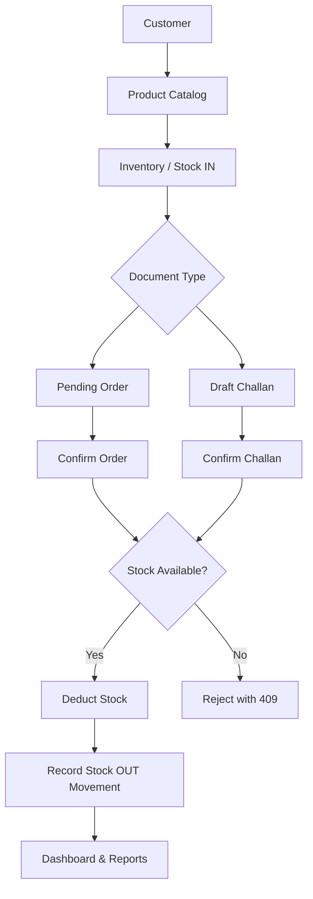
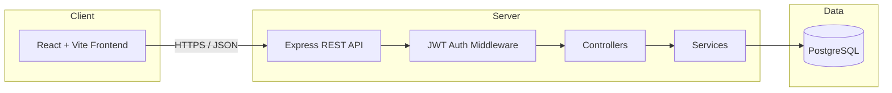

# FUNDSROOM ERP + CRM Operations Portal


A full-stack **Mini ERP + CRM Operations Portal** built for wholesale and distribution businesses. The application centralizes day-to-day operations—customer relationship management, product catalog, inventory control, sales orders, delivery challans, operational reporting, and role-based dashboards—through a modern React frontend and a RESTful Node.js/Express backend backed by PostgreSQL.

Built as a **Full Stack Developer case study** for **Fundsroom Infotech Pvt. Ltd.**

---

## 1. Project Overview

### Business context

Wholesale and distribution companies need a single system to track customers, stock levels, sales documents, and fulfillment workflows without relying on spreadsheets or disconnected tools.

### Problem solved

This portal replaces fragmented operational tracking with one authenticated web application where teams can:

- Manage customer records and CRM follow-ups
- Maintain products and warehouse stock
- Create sales orders and delivery challans with stock-safe confirmation flows
- Monitor KPIs and generate operational reports

### Target users

| Role | Typical use |
|------|-------------|
| **Admin** | Full system oversight, user registration, deletions |
| **Sales** | Customers, orders, challans, reports |
| **Warehouse** | Products, inventory movements, stock adjustments |
| **Accounts** | Read-focused access to customers, orders, and financial reports |

### Main objective

Deliver a production-style ERP/CRM portal with real database persistence, JWT authentication, role-based access, transactional stock rules, and export/print workflows suitable for portfolio and technical evaluation.

---

## 2. Key Features

| Module | Features |
|--------|----------|
| **Authentication** | Email/password login, JWT tokens, session restore via `/api/auth/profile`, global 401 handling, logout, inactive-user rejection |
| **RBAC** | Four roles (`admin`, `sales`, `warehouse`, `accounts`); frontend page/action gating; backend route-level authorization on write operations |
| **Customer CRM** | CRUD, search, active/inactive filter, company/contact/address/tax/credit fields, customer types (`retail`, `wholesale`, `distributor`), CRM status (`lead`, `active`, `inactive`), follow-up date, notes, CRM activities (call, email, meeting, etc.) |
| **Products** | CRUD, SKU, category, description, unit price, current stock, minimum stock, location/warehouse, search/filter, low-stock indicators |
| **Inventory** | Stock IN/OUT via product adjust-stock, movement history, quantity validation, insufficient-stock rejection, low-stock listing |
| **Orders** | Create pending orders, edit pending orders, confirm (stock validation + deduction), status updates, product snapshots on line items, revenue-aware reporting |
| **Sales Challans** | Create draft, edit draft, confirm, cancel, auto challan number, customer + multi-product lines, product snapshots, stock validation on confirm |
| **Reports** | Sales, customer, product performance, inventory, stock movement summary, stock status; date presets (Today, 7/30 days, 3/6 months, 1 year, custom); CSV export |
| **Print** | Browser-native print via `PrintProvider` (no popup windows); Print + Export CSV actions on reports, inventory, customers, products, challans, orders |
| **Dashboard** | Live KPIs from PostgreSQL, sales trend chart, date filters, low-stock counts, recent orders and CRM activities |
| **Global search** | Topbar search across customers, products, orders, and challans with navigation to the matching module |
| **Notifications** | Toast success/error feedback across forms and exports |
| **Settings** | Read-only profile view; **Admin user management UI** (create/edit/activate users) |
| **Help** | In-app help and support page |

---

## 3. Business Workflow



### Order workflow

- Creating a **pending** order does **not** deduct stock.
- **Confirming** an order validates available stock for each line item.
- If stock is insufficient, the API returns **409 Conflict**.
- On success, `products.current_stock` and `inventory.quantity` are reduced; a **stock OUT** movement is recorded.
- Product name and SKU snapshots are stored on `order_items` (migration 007).
- Confirmed orders cannot be deleted; only pending orders can be removed by admin.

### Challan workflow

- New challans are created in **draft** status and do **not** affect stock.
- Only **draft** challans can be edited.
- **Confirming** a draft validates stock, deducts quantities, and creates stock OUT movements.
- **Cancelled** challans cannot be confirmed.
- Line items store product snapshots (name, SKU, unit price at creation time).

### Inventory workflow

- Primary UI stock changes use `PATCH /api/products/:id/adjust-stock` (Stock IN / Stock OUT).
- Negative stock is prevented in application logic and by a database check constraint on `products.current_stock`.

---

## 4. User Roles & Permissions

Roles are defined in the database (`users.role`) and enforced in both frontend and backend.

### Frontend permissions (`frontend/src/utils/permissions.ts`)

Navigation and action buttons are gated by role. Unknown roles fall back to **sales** permissions.

| Role | Pages | Notable actions |
|------|-------|-----------------|
| **Admin** | All modules + Settings | Full CRUD, user management, delete customers/products |
| **Sales** | Dashboard, Customers, Products (view), Inventory (view), Challans, Orders, Reports, Help | Manage customers/orders/challans/activities; sales reports |
| **Warehouse** | Dashboard, Products (view), Inventory, Challans (view), Orders (view), Reports, Help | Stock adjustments; inventory report only |
| **Accounts** | Dashboard, Customers (view), Products (view), Inventory (view), Orders (view), Challans (view), Reports, Help | View + export sales/customer/product reports |

> **Note:** Frontend permissions improve UX. **Backend authorization is authoritative** for every protected API operation.

### Backend authorization

| Endpoint group | Access |
|----------------|--------|
| Customers GET | `admin`, `sales`, `accounts` |
| Customers write/delete | `admin`, `sales` / `admin` |
| Products / Inventory / Orders / Challans | Existing write rules unchanged |
| Dashboard | All four roles (`admin`, `sales`, `warehouse`, `accounts`) |
| Reports `/sales`, `/customers`, `/products` | `admin`, `sales`, `accounts` |
| Reports `/inventory`, `/stock-movements`, `/stock-status` | `admin`, `warehouse` |
| Activities GET | `admin`, `sales`, `accounts` |
| Activities write/delete | `admin`, `sales` |
| Users `/api/users/*` | `admin` only |
| User registration `/api/auth/register` | `admin` only |

---

## 5. Technology Stack

| Layer | Technology |
|-------|------------|
| **Frontend** | React 19, TypeScript, Vite 8, Tailwind CSS 3, Recharts |
| **Backend** | Node.js, TypeScript, Express.js 4 |
| **Database** | PostgreSQL (`pg` driver, connection pooling) |
| **Authentication** | JWT (`jsonwebtoken`), bcrypt password hashing |
| **Validation** | Joi (request/body/query schemas) |
| **Testing** | Jest + ts-jest (backend) |
| **Linting** | oxlint (frontend) |
| **API client** | Native `fetch` (custom `apiService` wrapper — Axios is **not** used) |
| **Version control** | Git / GitHub |

**Not configured in this repository:** Docker, CI/CD pipelines, cloud deployment manifests, or a live production URL.

---

## 6. System Architecture



- **Frontend:** State-based page navigation in `App.tsx` (no React Router). Context providers handle auth, toasts, global search, and print.
- **Backend:** Layered architecture — Routes → Controllers → Services → SQL queries.
- **Startup:** Server tests DB connectivity, runs migrations automatically, runs seed scripts in `development` only.

---

## 7. Project Structure

```text
Fundsroom-ERP-CRM/
├── README.md
├── .env.example
├── .gitignore
├── Fundsroom-ERP-CRM-API.postman_collection.json
│
├── frontend/
│   ├── package.json
│   ├── vite.config.ts
│   ├── tailwind.config.js
│   ├── .env.example
│   ├── public/
│   └── src/
│       ├── App.tsx                 # Login + page routing
│       ├── main.tsx
│       ├── components/
│       │   ├── ui/                 # Shared UI (KPICard, DocumentActions, etc.)
│       │   ├── layout/             # AppLayout, Sidebar, Topbar
│       │   ├── print/              # PrintProvider, PrintViews
│       │   ├── customers/          # CustomerModal
│       │   ├── products/           # ProductModal
│       │   ├── inventory/          # StockAdjustModal
│       │   ├── challans/           # CreateChallanModal
│       │   └── reports/            # SalesReportView
│       ├── context/                # Auth, Toast, Search, permissions hook
│       ├── documents/              # CSV builders, branding, helpers
│       ├── hooks/                  # useDocumentExport
│       ├── pages/                  # Dashboard, Customers, Products, etc.
│       ├── services/               # API service layer
│       ├── styles/print.css
│       └── utils/                  # permissions, validators, formatters, CSV
│
└── backend/
    ├── package.json
    ├── tsconfig.json
    ├── .env.example
    ├── scripts/                    # Demo data reset/verify utilities
    └── src/
        ├── server.ts               # Entry point
        ├── app.ts                  # Express app + CORS
        ├── config/                 # env, database, migration runner
        ├── controllers/
        ├── middleware/             # auth, errorHandler
        ├── migrations/             # 001–008 SQL migrations
        ├── routes/
        ├── services/
        ├── validators/
        ├── seeds/                  # Default role users (dev)
        ├── scripts/                # checkAdmin, testLogin (dev helpers)
        ├── types/
        ├── utils/
        └── __tests__/              # 12 test suites
```

---

## 8. Database Schema

Migrations run automatically on server startup (`backend/src/config/migration.ts`).

| Migration | Purpose |
|-----------|---------|
| **001** | `users` — authentication and roles |
| **002** | `customers`, `products`, `inventory`, `orders`, `order_items`, `stock_movements` |
| **003** | `customer_activities` — CRM follow-ups |
| **004** | Product fields: `unit_price`, `current_stock`, location, warehouse, movement constraints |
| **005** | `challans`, `challan_items` |
| **006** | Customer CRM fields: `customer_type`, `status`, `follow_up_date` |
| **007** | Order item snapshots: `product_name`, `sku` on `order_items` |
| **008** | Product schema alignment: `minimum_stock` index/sync |

### Core tables and relationships

```text
users
customers ──< orders ──< order_items >── products
customers ──< challans ──< challan_items >── products
customers ──< customer_activities
products  ──< inventory
products  ──< stock_movements
```

### Notable constraints

- Unique: `users.email`, `products.sku`, `orders.order_number`, `challans.challan_number`
- Check: non-negative `products.current_stock`, valid `customer_type` / `customer_status`, valid `stock_movements.movement_type` (`in` / `out`)
- Foreign keys link orders/challans/activities to customers and line items to products
- `inventory.available_quantity` is a generated column (`quantity - reserved_quantity`)

---

## 9. API Reference

Base URL (local): `http://localhost:5000`

All business endpoints (except health and login) require:

```http
Authorization: Bearer <JWT_TOKEN>
```

### Health

| Method | Endpoint | Auth | Description |
|--------|----------|------|-------------|
| GET | `/api/health` | No | Service health check |

### Authentication

| Method | Endpoint | Auth | Description |
|--------|----------|------|-------------|
| POST | `/api/auth/login` | No | Login, returns JWT + user |
| POST | `/api/auth/register` | Admin JWT | Register new user |
| GET | `/api/auth/profile` | JWT | Current user profile |

### Users (admin only)

| Method | Endpoint | Description |
|--------|----------|-------------|
| GET | `/api/users`, `/:id` | List / view users |
| POST | `/api/users` | Create user (admin; does not replace admin session token) |
| PUT | `/api/users/:id` | Update user profile/role |
| PATCH | `/api/users/:id/status` | Activate/deactivate user |

### Customers

| Method | Endpoint | Role (writes) | Description |
|--------|----------|---------------|-------------|
| GET | `/api/customers` | — | List/search (pagination) |
| GET | `/api/customers/:id` | — | Customer details |
| POST | `/api/customers` | admin, sales | Create |
| PUT | `/api/customers/:id` | admin, sales | Update |
| DELETE | `/api/customers/:id` | admin | Hard delete |
| PATCH | `/api/customers/:id/deactivate` | admin | Deactivate |

### Products

| Method | Endpoint | Role (writes) | Description |
|--------|----------|---------------|-------------|
| GET | `/api/products` | — | List/search |
| GET | `/api/products/active` | — | Active products only |
| GET | `/api/products/:id` | — | Product details |
| POST | `/api/products` | admin, warehouse | Create |
| PUT | `/api/products/:id` | admin, warehouse | Update |
| PATCH | `/api/products/:id/adjust-stock` | admin, warehouse | Stock IN/OUT |
| DELETE | `/api/products/:id` | admin | Delete |

### Inventory

| Method | Endpoint | Role (writes) | Description |
|--------|----------|---------------|-------------|
| GET | `/api/inventory` | — | All inventory records |
| GET | `/api/inventory/low-stock` | — | Low-stock products |
| GET | `/api/inventory/movements` | — | Stock movement history |
| GET | `/api/inventory/product/:productId` | — | Inventory by product |
| POST | `/api/inventory` | admin, warehouse | Create inventory row |
| POST | `/api/inventory/movements` | admin, warehouse | Record movement (audit log) |
| PATCH | `/api/inventory/product/:productId/quantity` | admin, warehouse | Adjust inventory quantity |
| PUT | `/api/inventory/:id` | admin, warehouse | Update inventory row |
| DELETE | `/api/inventory/:id` | admin | Delete inventory row |

### Orders

| Method | Endpoint | Role (writes) | Description |
|--------|----------|---------------|-------------|
| GET | `/api/orders` | — | List/search |
| GET | `/api/orders/stats` | — | Order statistics |
| GET | `/api/orders/:id` | — | Order with items |
| GET | `/api/orders/number/:orderNumber` | — | Lookup by order number |
| GET | `/api/orders/customer/:customerId` | — | Orders for customer |
| POST | `/api/orders` | admin, sales | Create pending order |
| PUT | `/api/orders/:id` | admin, sales | Update pending order |
| POST | `/api/orders/:id/confirm` | admin, sales | Confirm + deduct stock |
| PATCH | `/api/orders/:id/status` | admin, sales | Update status |
| DELETE | `/api/orders/:id` | admin | Delete pending order |

### Sales Challans

| Method | Endpoint | Role (writes) | Description |
|--------|----------|---------------|-------------|
| GET | `/api/challans` | — | List/search |
| GET | `/api/challans/:id` | — | Challan with items |
| POST | `/api/challans` | admin, sales | Create draft |
| PUT | `/api/challans/:id` | admin, sales | Update draft |
| POST | `/api/challans/:id/confirm` | admin, sales | Confirm + deduct stock |
| POST | `/api/challans/:id/cancel` | admin, sales | Cancel challan |
| DELETE | `/api/challans/:id` | admin | Delete |

### CRM Activities

| Method | Endpoint | Description |
|--------|----------|-------------|
| GET | `/api/activities` | List activities |
| GET | `/api/activities/:id` | Activity by ID |
| GET | `/api/activities/customer/:customerId` | Activities for customer |
| GET | `/api/activities/customer/:customerId/timeline` | Activity timeline |
| POST | `/api/activities` | Create activity |
| PUT | `/api/activities/:id` | Update activity |
| DELETE | `/api/activities/:id` | Delete activity |

### Dashboard

| Method | Endpoint | Description |
|--------|----------|-------------|
| GET | `/api/dashboard/stats` | KPI summary (supports date filters) |
| GET | `/api/dashboard/recent-orders` | Recent orders |
| GET | `/api/dashboard/recent-activities` | Recent CRM activities |
| GET | `/api/dashboard/order-status-summary` | Orders grouped by status |
| GET | `/api/dashboard/sales-trend` | Sales trend series |
| GET | `/api/dashboard/top-products` | Top selling products |
| GET | `/api/dashboard/low-stock-products` | Low-stock product list |

### Reports

| Method | Endpoint | Description |
|--------|----------|-------------|
| GET | `/api/reports/sales` | Sales report (date filters applied) |
| GET | `/api/reports/customers` | Customer report |
| GET | `/api/reports/products` | Product performance report |
| GET | `/api/reports/inventory` | Inventory report |
| GET | `/api/reports/stock-movements` | Stock movement summary |
| GET | `/api/reports/stock-status` | Product stock status |

**Query parameters (reports):** `start_date`, `end_date`, `customer_id`, `product_id`, `status` (validated by Joi; same-day ranges are supported).

---

## 10. Local Development Setup

### Prerequisites

- **Node.js** 18+ (20+ recommended)
- **PostgreSQL** 12+ (local, Docker, or hosted e.g. Neon)
- **npm**

### 1. Clone the repository

```bash
git clone <repository-url>
cd Fundsroom-ERP-CRM
```

### 2. Configure environment variables

**Backend** — copy and edit:

```bash
cp backend/.env.example backend/.env
```

**Frontend** — copy and edit:

```bash
cp frontend/.env.example frontend/.env
```

See [Environment Variables](#11-environment-variables) below.

### 3. Install dependencies

```bash
cd backend && npm install
cd ../frontend && npm install
```

### 4. Start PostgreSQL

Create a database (example name: `fundsroom_erp_crm`) and set `DATABASE_URL` in `backend/.env`.

### 5. Start the backend

```bash
cd backend
npm run dev
```

On startup the server will:

1. Test the database connection
2. Run migrations (`001`–`008`)
3. Run seed scripts **in development** (default demo users)

API available at: `http://localhost:5000`

### 6. Start the frontend

```bash
cd frontend
npm run dev
```

App available at: `http://localhost:5173`

---

## 11. Environment Variables

### Backend (`backend/.env`)

| Variable | Required | Description |
|----------|----------|-------------|
| `PORT` | No | Server port (default: `5000`) |
| `NODE_ENV` | No | `development` or `production` |
| `DATABASE_URL` | **Yes** | PostgreSQL connection string |
| `JWT_SECRET` | **Yes (production)** | Secret for signing JWTs — **required when `NODE_ENV=production`** |
| `FRONTEND_URL` | No | Frontend origin (default: `http://localhost:5173`) |

### Frontend (`frontend/.env`)

| Variable | Required | Description |
|----------|----------|-------------|
| `VITE_API_URL` | No | Backend API URL (default: `http://localhost:5000`) |

> **Security:** Set a strong random `JWT_SECRET` in production. The server **refuses to start** in production without it. Development uses a local-only fallback.

> **CORS:** Restricted to `FRONTEND_URL` (plus localhost in development).

---

## 12. Demo Credentials

Seeded automatically when `NODE_ENV=development`:

| Role | Email | Password |
|------|-------|----------|
| Admin | admin@fundsroom.com | Admin@123 |
| Sales | sales@fundsroom.com | Admin@123 |
| Warehouse | warehouse@fundsroom.com | Admin@123 |
| Accounts | accounts@fundsroom.com | Admin@123 |

Change all default passwords before production use.

---

## 13. Testing

### Backend

```bash
cd backend
npm test          # Run all tests
npm run type-check
npm run build
```

**Current results (verified locally):**

| Suite | Result |
|-------|--------|
| Backend tests | **118 passed** / 118 total (12 suites) |
| Backend type-check | Pass |
| Backend build (`tsc`) | Pass |

Test coverage includes: authentication, validators, customer/product/inventory/order services, dashboard, reporting, and database connectivity.

### Frontend

```bash
cd frontend
npm run build     # TypeScript + Vite production build
npm run lint      # oxlint
```

| Suite | Result |
|-------|--------|
| Frontend build | Pass |
| Frontend unit tests | **Not configured** |
| Frontend lint | Pass (warnings only) |

---

## 14. Postman Collection

Import `Fundsroom-ERP-CRM-API.postman_collection.json` into Postman.

**Variables:**

| Variable | Default |
|----------|---------|
| `baseUrl` | `http://localhost:5000` |
| `token` | *(set after login)* |

**Workflow:**

1. Send **Login** request to `POST {{baseUrl}}/api/auth/login` with demo credentials.
2. Copy the JWT from the response into the collection `token` variable.
3. All other requests use Bearer auth automatically.

> **Postman:** Login request path corrected to `/api/auth/login`. Copy JWT into the `token` collection variable after login.

The collection covers core CRUD endpoints but does **not** yet include all dashboard, reports, or user-management routes.

---

## 15. Developer Scripts

| Script | Location | Purpose |
|--------|----------|---------|
| `npm run dev` | frontend / backend | Development servers |
| `npm run build` | frontend / backend | Production build |
| `npm start` | backend | Run compiled server |
| `reset-demo-data.ts` | `backend/scripts/` | Reset demo business data |
| `verify-demo-data.ts` | `backend/scripts/` | Verify stock/data consistency |
| `002_fresh_demo_data.sql` | `backend/scripts/` | SQL demo dataset |
| `checkAdmin.ts`, `testLogin.ts`, `testPassword.ts` | `backend/src/scripts/` | Local auth debugging helpers |

---

## 16. Deployment

**Deployment pending** — no live production URL or automated deployment pipeline is configured in this repository.

General production checklist:

1. Provision PostgreSQL and set `DATABASE_URL`.
2. Set a strong `JWT_SECRET` and `NODE_ENV=production`.
3. Build backend: `cd backend && npm run build && npm start`
4. Build frontend: `cd frontend && npm run build` — serve `frontend/dist` via static hosting (Nginx, Vercel, Netlify, etc.).
5. Set `VITE_API_URL` to your deployed API URL **before** building the frontend.
6. Restrict CORS to your frontend domain (currently open in `backend/src/app.ts`).
7. Move `joi` to production `dependencies` if installing with `npm install --production`.

---

## 17. Implementation Status

### Completed

- Full-stack ERP/CRM modules (customers, products, inventory, orders, challans)
- JWT authentication with session restoration
- Role-based frontend navigation and backend write authorization
- Dashboard with live PostgreSQL KPIs and charts
- Reports with CSV export and browser print
- Global topbar search
- Toast notifications
- Automatic migrations and development seeds
- 118 backend unit/integration tests

### Known limitations

| Area | Status |
|------|--------|
| **Production deployment** | Not configured — deployment pending |
| **Frontend unit tests** | Not implemented |
| **URL routing** | State-based navigation (no deep links / React Router) |
| **Report date filters (non-sales)** | Customer/product/inventory report APIs do not apply date filters (UI may send them) |
| **Pagination UI** | Backend supports pagination; frontend loads larger fixed limits |
| **Postman collection** | Missing dashboard/reports/user-management request groups |
| **Read endpoints (products/orders/challans)** | JWT required; role checks on GET are partial (customers, dashboard, reports, activities are role-restricted) |

---

## 18. License

ISC — see backend `package.json`.

---

## 19. Author

Developed as a Full Stack Developer case study for **Fundsroom Infotech Pvt. Ltd.**
